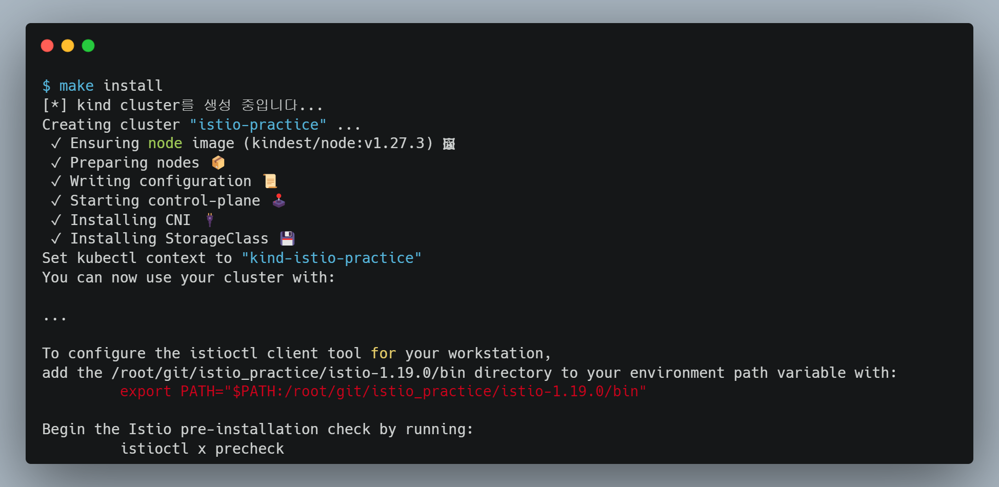
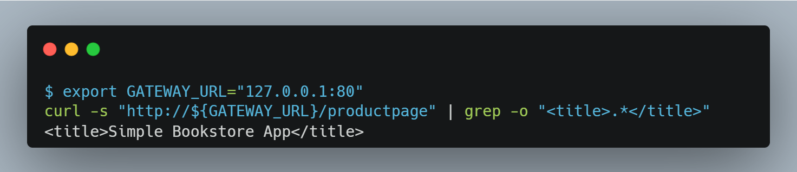

# 1. 개요
* istio 공부내용 정리

<br>

# 2. 실습환경 구축
* kind 클러스터와 istioctl, istio를 설치

## 2.1 전제조건
* docker(또는 rancher desktop)가 설치되어 있어야 함 -> kind cluster 구축할 때 docker 사용

## 2.2 실습환경 생성
* makefile 스크립트를 이용해서 환경 생성 자동화

```bash
make install
```

## 2.3 생성 확인

* istio 설치 확인

```bash
kubectl -n istio-system get pod
```

* istioctl 설치 확인

```bash
# istio github 디렉터리 확인
# istioctl 설치과정에서 istio github을 자동으로 다운로드 함
ls istio-x.x.x

# istioctl 명령어 경로를 환경변수로 설정
export PATH="$PATH:/root/git/istio_practice/istio-1.19.0/bin"

# istioctl 명령어 실행 확인
istioctl x precheck
```



# 3. 실습환경 삭제
* makefile 스크립트를 이용해서 환경 삭제

```bash
make uninstall
```

# 4. istio 샘플 애플리케이션 배포

* default namespace에 istio inject 설정
```bash
kubectl label namespace default istio-injection=enabled
```

* 샘플 애플리케이션 배포
```bash
# istioctl github repo로 이동
# istioctl 설치과정에서 istio github을 자동으로 다운로드 함
cd istio-x.x.x

# 애플리케이션 배포
kubectl apply -f samples/bookinfo/platform/kube/bookinfo.yaml

# gateway 설정 배포
kubectl apply -f samples/bookinfo/networking/bookinfo-gateway.yaml

# 접속
# reference: https://istio.io/latest/docs/tasks/traffic-management/ingress/ingress-control/#using-node-ports-of-the-ingress-gateway-service
export GATEWAY_URL="127.0.0.1:80"
curl -s "http://${GATEWAY_URL}/productpage" | grep -o "<title>.*</title>"
```



# 5. 모니터링
* istio addons를 설치하여 메트릭 등을 모니터링

```bash
cd istio-x.x.x
kubectl apply -f samples/addons/
```

# 부록. istio 수동 설치 방법
* [istio 설치 문서 바로가기](./manifests/install-istio/README.md)


# 참고자료
* kind cluster에서 istio 설치: https://medium.com/@s4l1h/how-to-install-kind-and-istio-ingress-controller-3b510834c762
* istio nodeport: https://github.com/kubernetes-sigs/kind/issues/2374
* istio nodeport: https://itnp.kr/post/install-istio
