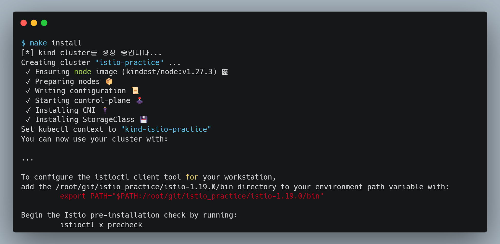

# 개요
* istio 실습을 위한 환경구축 방법 정리
* kind 클러스터와 istioctl, istio를 설치

<br>

# 1/ 전제조건
* docker(또는 rancher desktop)가 설치되어 있어야 함 -> kind cluster 구축할 때 docker 사용

<br>

# 2. 실습환경 생성
* makefile 스크립트를 이용해서 환경 생성 자동화

```bash
make install
```

<br>

# 3. 생성 확인

* istio 설치 확인

```bash
kubectl -n istio-system get pod
```

* istioctl 설치 확인

```bash
# istio github 디렉터리 확인
# istioctl 설치과정에서 istio github을 자동으로 다운로드 함
ls istio-x.x.x

# istioctl 명령어 경로를 환경변수로 설정
export PATH="$PATH:/root/git/istio_practice/istio-1.19.0/bin"

# istioctl 명령어 실행 확인
istioctl x precheck
```



<br>

# 4. 실습환경 삭제
* makefile 스크립트를 이용해서 환경 삭제

```bash
make uninstall
```
